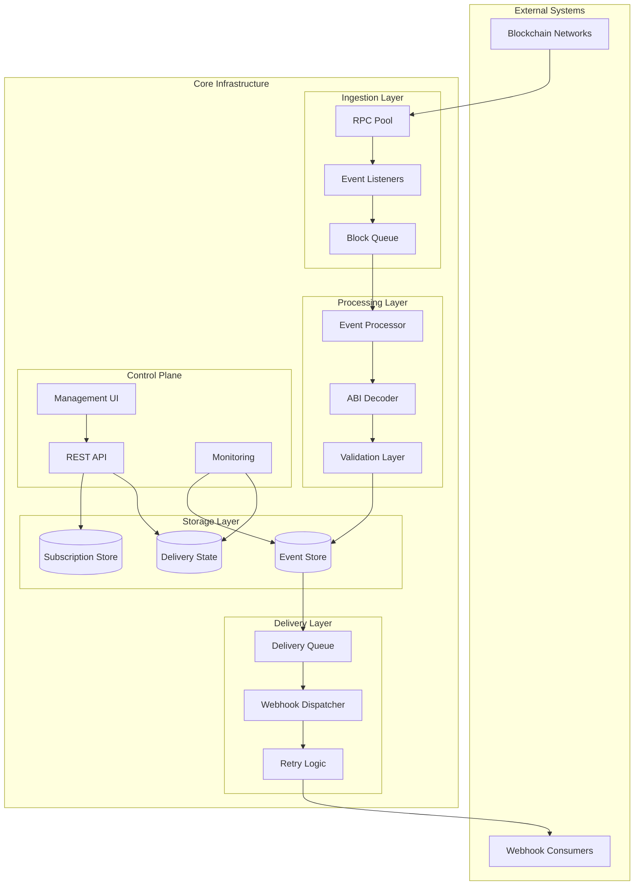
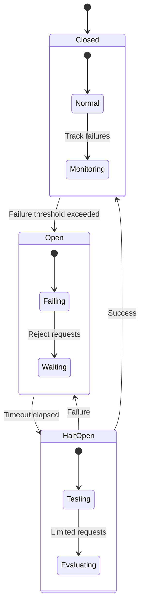
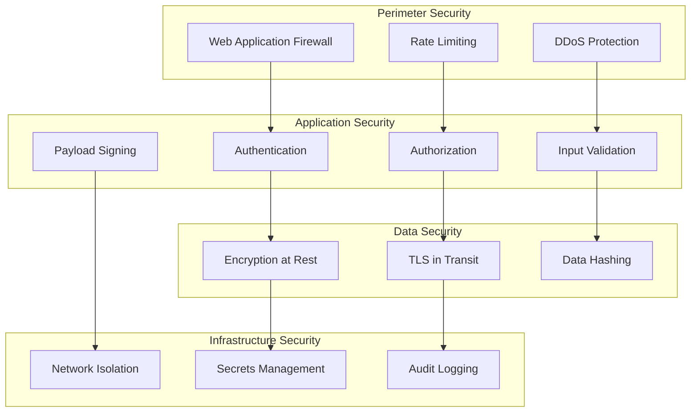
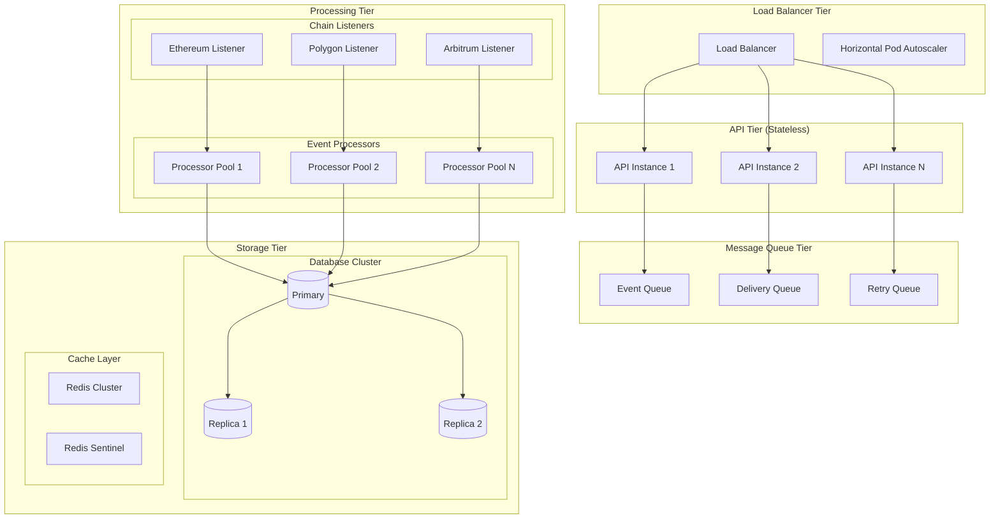
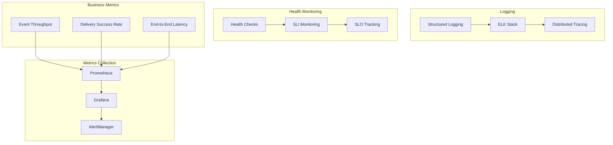
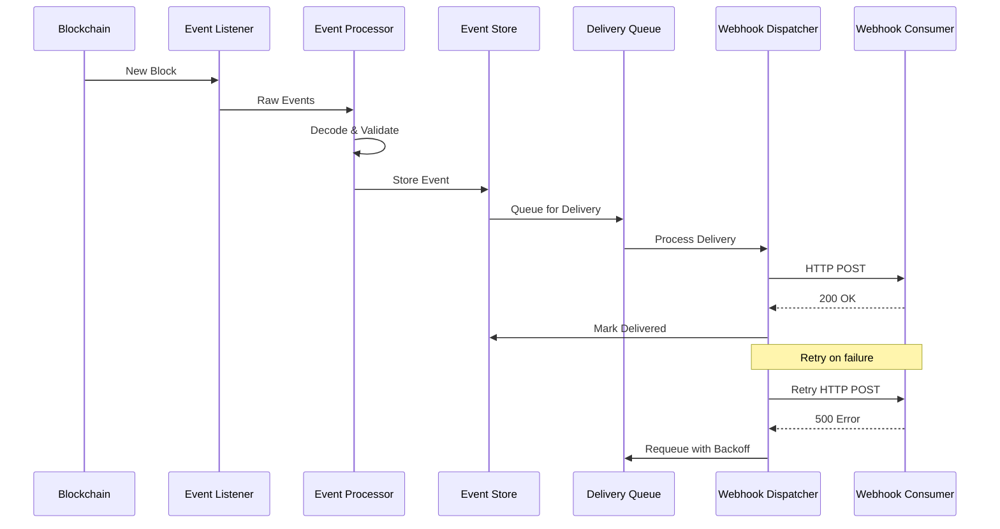

PROJECT NAME
Fault-Tolerant On-Chain Event Webhook Infrastructure

## System Architecture Overview



WHAT THIS IS

This service provides a reliable way to consume smart contract events as standard HTTP webhooks using only a contract ABI.

Instead of running and maintaining blockchain listeners, ABI decoders, retry logic, and failure handling in every application, teams integrate once and receive decoded, structured JSON events over HTTP.

The system is designed to reduce:

operational complexity

infrastructure surface area

duplicated logic across services

silent data loss from RPC or webhook failures

THE PROBLEM IT SOLVES

Most Web3 backends need on-chain events. Almost none want to operate blockchain listeners.

In practice, teams run into the same issues repeatedly:

Event listeners drop when RPC connections reset

Missed logs are discovered days later, if ever

ABI decoding logic is duplicated across services

Webhook consumers fail and events are lost

Scaling listeners becomes harder than scaling the app itself

The result is fragile infrastructure where correctness depends on everything staying up all the time.

This service exists to make event delivery boring, predictable, and auditable.

WHY THIS APPROACH WORKS BETTER

Fewer moving parts for the user

No RPC subscriptions to manage

No ABI decoding code in application logic

No retry queues to build and tune

Failure is handled centrally

Events are persisted before delivery

Webhook failures are retried automatically

Delivery state is observable and replayable

The integration surface is stable

HTTP in, HTTP out

ABI defines the contract, not infrastructure assumptions

Complexity scales once, not per project

One listener system instead of N

One decoding pipeline instead of scattered utilities

HOW IT WORKS (HIGH LEVEL)

Register a subscription
The user provides:

Chain ID

Contract address

ABI

Optional event filters

One or more webhook endpoints

Event ingestion

The service maintains chain listeners

Logs are captured as blocks are processed

Events are persisted immediately

Decoding and normalization

Logs are decoded using the stored ABI

Payloads are normalized into a consistent JSON schema

Delivery

Events are delivered to webhooks

Retries and backoff are applied on failure

Delivery attempts are recorded

EVENT PAYLOADS

Webhook payloads are delivered as clean, decoded JSON.

Each payload includes:

event name

contract address

chain ID

decoded event arguments

transaction hash

block number

block timestamp

log index

No raw hex unless the user explicitly wants it.

This makes downstream consumers simpler, testable, and language-agnostic.

FAULT TOLERANCE BY DESIGN

This system assumes failure is normal.

RPC connections drop

Nodes go out of sync

Webhook endpoints go down

Networks experience reorgs

To handle this:

Events are stored before delivery

Delivery is retried with backoff

Duplicate deliveries are expected and supported via idempotency

Failed deliveries can be replayed

The goal is correctness over optimism.

## Fault Tolerance Deep Dive

### Circuit Breaker Pattern



### Failure Recovery Strategies

**RPC Connection Failures**
- Connection pooling with health checks
- Automatic failover to backup RPC endpoints
- Exponential backoff with jitter
- Circuit breaker per RPC provider

**Event Processing Failures**
- Dead letter queues for poison messages
- Checkpoint-based recovery
- Idempotent processing with deduplication
- Graceful degradation modes

**Webhook Delivery Failures**
- Exponential backoff: 1s, 2s, 4s, 8s, 16s, 32s
- Maximum retry attempts: 6 (total ~63s)
- Permanent failure detection (4xx responses)
- Bulk retry operations for operational recovery

### Data Consistency Guarantees

**At-Least-Once Delivery**
- Events persisted before processing
- Delivery attempts tracked with idempotency keys
- Duplicate detection via event signature hashing

**Eventual Consistency**
- Chain reorganization handling
- Block confirmation requirements
- State reconciliation processes

CUSTOMIZATION OPTIONS

Without increasing integration complexity, users can configure:

Event filtering (by event name or signature)

Multiple webhook endpoints per subscription

Retry limits and backoff strategies

Payload signing for webhook verification

Replay windows for historical events

The default configuration works out of the box. Advanced options are opt-in.

SECURITY MODEL

Webhook payloads can be cryptographically signed

Timestamps prevent replay attacks

No private keys are stored or managed

ABI validation prevents malformed decoders

This service observes the chain. It never transacts.

## Security Architecture

### Defense in Depth



### Cryptographic Security

**Webhook Signature Verification**
```
HMAC-SHA256(payload + timestamp, secret_key)
```

**Payload Integrity**
- Event content hashing for deduplication
- Merkle tree verification for batch operations
- Cryptographic proof of delivery attempts

**Key Management**
- Webhook secrets rotated automatically
- No blockchain private keys stored
- HSM integration for production deployments

### Attack Surface Mitigation

**Input Validation**
- ABI schema validation against known patterns
- Contract address verification
- Webhook URL allowlist support

**Rate Limiting**
- Per-subscription event rate limits
- API endpoint throttling
- Webhook delivery rate controls

**Monitoring & Alerting**
- Anomaly detection for unusual event patterns
- Failed authentication attempt tracking
- Webhook endpoint health monitoring

SCALING CHARACTERISTICS

The system scales by separation of concerns:

API layer is stateless

Event ingestion is shardable by chain or contract

Processing and delivery are queue-driven

Storage acts as the source of truth

High event volume affects throughput, not correctness.

## Scaling Patterns & Performance

### Horizontal Scaling Architecture



### Performance Characteristics

**Throughput Targets**
- 10,000+ events/second ingestion
- 5,000+ webhooks/second delivery
- Sub-100ms API response times
- 99.9% delivery success rate

**Scaling Dimensions**

*Vertical Scaling*
- CPU: Event processing and ABI decoding
- Memory: In-memory queues and caching
- I/O: Database writes and webhook delivery

*Horizontal Scaling*
- API instances: Stateless, auto-scaling
- Listener sharding: By chain or contract
- Queue workers: Dynamic scaling based on depth

### Resource Optimization

**Memory Management**
- Event batching to reduce memory pressure
- Streaming processing for large payloads
- Connection pooling for database and HTTP

**CPU Optimization**
- ABI decoding caching
- Parallel event processing
- Async I/O for webhook delivery

**Storage Optimization**
- Event data partitioning by timestamp
- Index optimization for query patterns
- Automated data archival policies

WHEN THIS MAKES SENSE

This service is useful when:

On-chain events drive backend workflows

Missed events are unacceptable

Multiple services depend on the same contracts

Operational simplicity matters more than novelty

It is especially valuable for teams that want to focus on product logic rather than infrastructure plumbing.

NON-GOALS

Not a block explorer

Not a general indexer

Not a wallet or signing service

This tool does one thing: deliver smart contract events reliably.

## Operational Excellence

### Observability Stack



### Key Performance Indicators

**Reliability Metrics**
- Event ingestion success rate: >99.95%
- Webhook delivery success rate: >99.9%
- System uptime: >99.99%
- Mean time to recovery: <5 minutes

**Performance Metrics**
- Event processing latency: P95 <500ms
- Webhook delivery latency: P95 <2s
- API response time: P95 <100ms
- Queue depth: <1000 messages

**Business Metrics**
- Events processed per day
- Active subscriptions
- Webhook endpoint health
- Cost per event delivered

### Deployment Strategies

**Blue-Green Deployment**
- Zero-downtime deployments
- Instant rollback capability
- Database migration handling
- Traffic switching automation

**Canary Releases**
- Gradual traffic shifting
- Automated rollback triggers
- A/B testing capabilities
- Risk mitigation

### Disaster Recovery

**Backup Strategy**
- Continuous database replication
- Point-in-time recovery capability
- Cross-region backup storage
- Automated backup verification

**Recovery Procedures**
- RTO: <15 minutes
- RPO: <5 minutes
- Automated failover processes
- Runbook automation

## Integration Patterns

### Event-Driven Architecture



### Webhook Integration Patterns

**Standard Webhook**
```json
{
  "eventId": "evt_1234567890",
  "eventName": "Transfer",
  "contractAddress": "0xa0b86991c6218b36c1d19d4a2e9eb0ce3606eb48",
  "chainId": 1,
  "blockNumber": 18500000,
  "transactionHash": "0x...",
  "timestamp": "2024-01-15T10:30:00Z",
  "args": {
    "from": "0x...",
    "to": "0x...",
    "value": "1000000"
  }
}
```

**Batch Webhook**
```json
{
  "batchId": "batch_1234567890",
  "events": [...],
  "metadata": {
    "totalEvents": 50,
    "blockRange": [18500000, 18500010]
  }
}
```

### API Integration Patterns

**Subscription Management**
- RESTful API design
- Idempotent operations
- Pagination support
- Filtering and sorting

**Event Querying**
- Historical event access
- Real-time event streaming
- GraphQL support for complex queries
- Webhook replay functionality

### Third-Party Integrations

**Monitoring Integrations**
- Datadog APM
- New Relic monitoring
- PagerDuty alerting
- Slack notifications

**Infrastructure Integrations**
- Kubernetes operators
- Terraform providers
- AWS CloudFormation
- Docker containerization

---

## Architecture Decision Records

### ADR-001: Event Storage Strategy
**Decision**: Use MongoDB for event storage with time-series collections
**Rationale**: Optimized for high-write workloads, built-in sharding, flexible schema
**Consequences**: Eventual consistency, requires careful index management

### ADR-002: Message Queue Selection
**Decision**: Redis Streams for event queuing
**Rationale**: Persistence, consumer groups, low latency, operational simplicity
**Consequences**: Memory usage scales with queue depth, requires clustering for HA

### ADR-003: Webhook Retry Strategy
**Decision**: Exponential backoff with jitter and circuit breaker
**Rationale**: Prevents thundering herd, respects downstream capacity
**Consequences**: Increased delivery latency for failing endpoints

## Getting Started

### Prerequisites

- Node.js 18+
- pnpm
- MongoDB (local or Atlas)

### Backend Setup

```bash
cd Backend
pnpm install
```

Create a `.env` file:

```env
PORT=3000
MONGO_URI=mongodb://localhost:27017/event-webhook-service
NODE_ENV=development
```

Run the server:

```bash
pnpm dev
```

The API will be available at `http://localhost:3000`.

### Frontend Setup

```bash
cd Frontend
pnpm install
pnpm dev
```

The UI will be available at `http://localhost:5173`.

---

## API Reference

### Create Subscription

```bash
POST /subscriptions
Content-Type: application/json

{
  "chainId": 1,
  "contractAddress": "0xa0b86991c6218b36c1d19d4a2e9eb0ce3606eb48",
  "abi": [{"type": "event", "name": "Transfer", ...}],
  "webhookUrl": "https://your-endpoint.com/webhook"
}
```

### List Subscriptions

```bash
GET /subscriptions
```

---

## Project Structure

```
├── Backend/
│   ├── src/
│   │   ├── index.ts          # Fastify server entry
│   │   ├── config.ts         # Environment config
│   │   ├── models.ts         # Mongoose schemas
│   │   ├── routes/           # API routes
│   │   └── services/         # Listener & Delivery
│   └── scripts/              # Test utilities
└── Frontend/                 # SvelteKit dashboard
```

## Advanced Configuration

### Environment Variables

```bash
# Core Configuration
PORT=3000
NODE_ENV=production
MONGO_URI=mongodb://localhost:27017/event-webhook-service

# RPC Configuration
ETHEREUM_RPC_URL=https://mainnet.infura.io/v3/YOUR_KEY
POLYGON_RPC_URL=https://polygon-mainnet.infura.io/v3/YOUR_KEY
RPC_TIMEOUT=30000
RPC_RETRY_ATTEMPTS=3

# Queue Configuration
REDIS_URL=redis://localhost:6379
QUEUE_CONCURRENCY=10
MAX_RETRY_ATTEMPTS=6
RETRY_BACKOFF_BASE=1000

# Security Configuration
WEBHOOK_SECRET_KEY=your-secret-key
JWT_SECRET=your-jwt-secret
RATE_LIMIT_WINDOW=900000
RATE_LIMIT_MAX=100

# Monitoring Configuration
METRICS_PORT=9090
LOG_LEVEL=info
ENABLE_TRACING=true
```

### Production Deployment

**Docker Compose**
```yaml
version: '3.8'
services:
  api:
    image: fault-tolerant-webhook:latest
    ports:
      - "3000:3000"
    environment:
      - NODE_ENV=production
    depends_on:
      - mongodb
      - redis
  
  mongodb:
    image: mongo:6.0
    volumes:
      - mongodb_data:/data/db
  
  redis:
    image: redis:7.0
    volumes:
      - redis_data:/data

volumes:
  mongodb_data:
  redis_data:
```

**Kubernetes Deployment**
```yaml
apiVersion: apps/v1
kind: Deployment
metadata:
  name: webhook-service
spec:
  replicas: 3
  selector:
    matchLabels:
      app: webhook-service
  template:
    metadata:
      labels:
        app: webhook-service
    spec:
      containers:
      - name: api
        image: fault-tolerant-webhook:latest
        ports:
        - containerPort: 3000
        env:
        - name: NODE_ENV
          value: "production"
        resources:
          requests:
            memory: "256Mi"
            cpu: "250m"
          limits:
            memory: "512Mi"
            cpu: "500m"
```